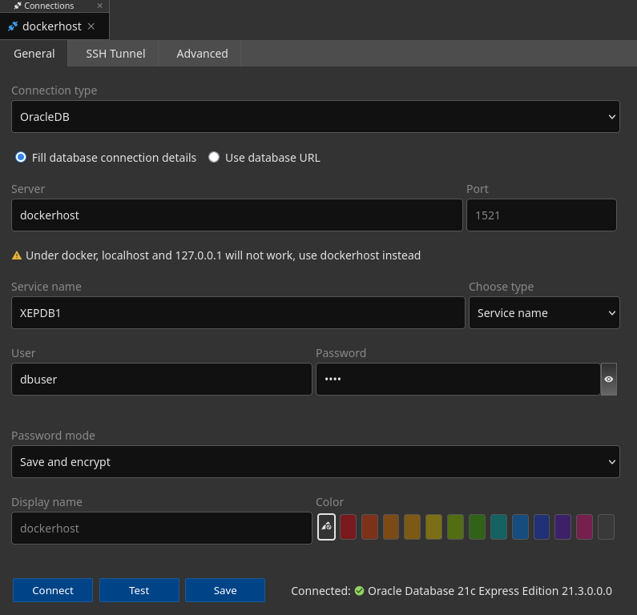

# ADB PWr

## DB Setup
Create .env file with contents:
```
ORACLE_PASSWORD=<your_password_here>
```
Run containers:
```sh
docker compose up
```
Enter oracle container:
```sh
export IDORA=$(docker ps -a | grep oracle-xe | awk '{print $1}')
docker exec -u oracle -it $IDORA sh
```
(Inside docker shell) run sqlplus:
```sh
sqlplus / as sysdba
```
(Inside SQL command line) run:
```sql
ALTER SESSION SET CONTAINER = XEPDB1;
CREATE USER dbuser IDENTIFIED BY "pass";
GRANT CONNECT, RESOURCE TO dbuser;
ALTER USER dbuser QUOTA UNLIMITED ON USERS;
```
Then disconnect (ctrl-d) and connect as new user (this may take a while):
```sh
sqlplus dbuser/pass@XEPDB1
```
Now whenever you connect you can use the above command.

## Creating table schema
Just copy and paste contents of [create_tables.sql](sql/create_tables.sql) into the SQL command line.

## DbGate
Use the below config to connect:

